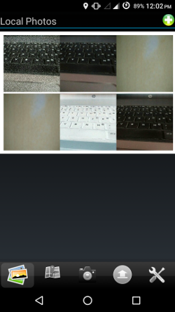

# phimpme-android
Phimp.me - Photo App

## Maintainers
The project is maintained by
- Hon Nguyen ([@vanhonit](https://github.com/vanhonit))
- Mario Behling ([@mariobehling](http://github.com/mariobehling))
- Pawan Pal ([@pa1pal](http://github.com/pa1pal))

## Screenshots

## Documentation

You can find the android app docs [here](docs/AndroidApp.md)

## License

This project is currently licensed under the GNU General Public License v3. A copy of [LICENSE](LICENSE.md) is to be present along with the source code. To obtain the software under a different license, please contact FOSSASIA.
