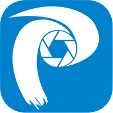
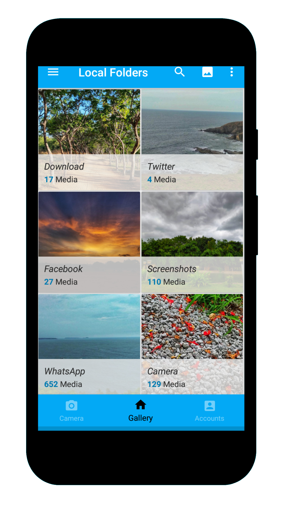
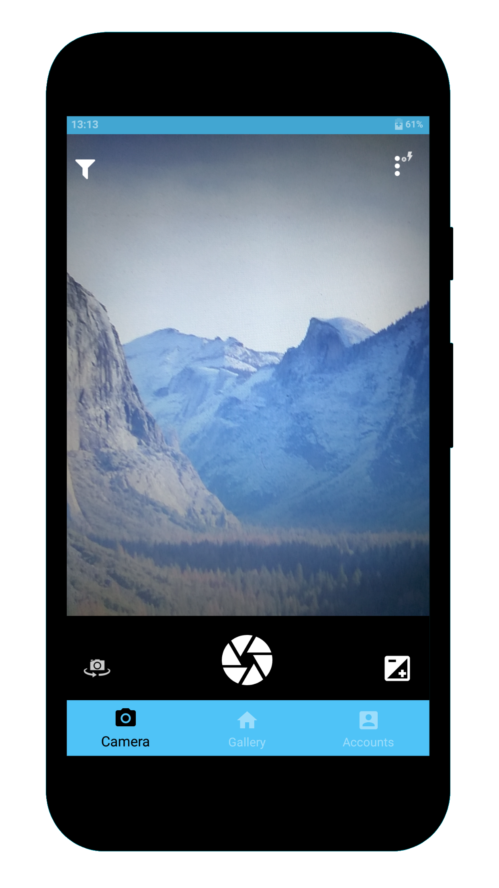
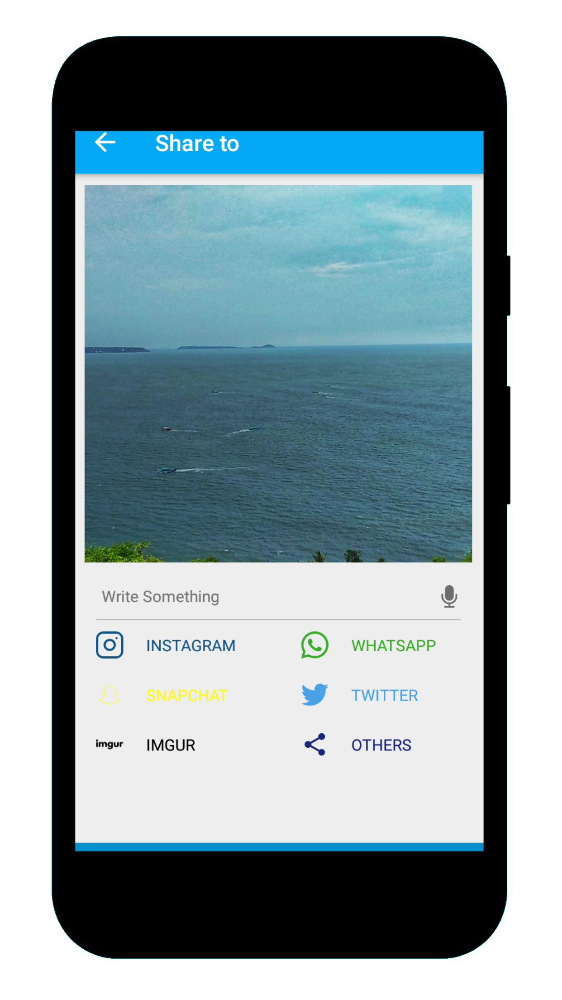
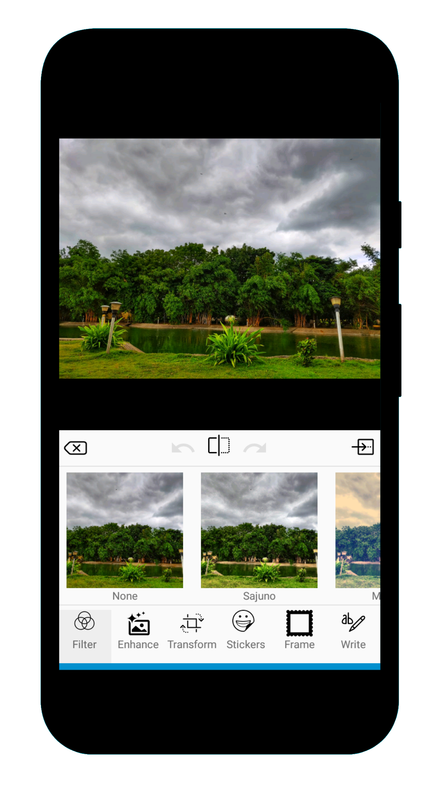

# Phimp.me Android

<a href='https://phimp.me'>Phimp.me</a> is an Android image editor app that aims to replace proprietary photographing and image apps on smart phones. It offers features such as taking photos, adding filters, editing images and uploading them to social networks. Phimp.me stands for **Ph**otos - **Im**ages - **P**ictures. It is developed at <a href='https://fossasia.org'>FOSSASIA</a> together with a global community.

| Master | Development | Codecov | Code Quality | Chat | Twitter |
|------------|-----------------|-------------|-----------------|-----------------|-----------------|
|  |  |  |  |  |  |

## Download from Play Store

## Screenshots

  
   
  
   
   
  

Do you have many different apps on your Android Phone for the purpose of clicking, editing and sharing images? Hey, guess what, now you don't need all of those because `Phimp.me` is here, with all the features packaged into one. So go and clean your phone memory to save your space for other useful purposes.

## Features

* Click beautiful images using the Phimp.me app. Use various advanced scene modes and variety of balance modes.

* You can use your voice actions to invoke Camera, Just say "Ok Google click a picture". You can also select front and rear camera based on voice.

* Browse the local gallery inside the app with folder and all photos mode. Copy, move and add a description to the images.

* Edit images with various cool filters with optimized performance, built using OpenCV library.

* Enhance contrast, hue, Satur, temp, tint, and sharpness of the image.

* Use 'Crop and rotate' features from Transform section to get your perfect image.

* Apply different stickers - facial, express, objects, comments, wishes, emojis, hashtag

* Write anything on the images in your handwriting!

* Don't be afraid to experiment as you can easily go back and forth with 'redo' and 'undo'.

* Finally, after all this editing you can easily share the image to your favourite social media sites with our easy-to-use sharing feature.

* Facebook, Messenger, Twitter, NextCloud, OwnCloud, Imgur, Dropbox, Box, Flickr, Pinterest, Instagram, Whatsapp, and Tumblr - You name it and we have it covered.

## How to Contribute
This is an Open Source project and we would be happy to see contributors who report bugs and file feature requests by submitting pull requests as well.This project adheres to the [Contributor Covenant](https://github.com/fossasia/phimpme-android/blob/development/CONTRIBUTING.md). By participating, you are expected to uphold this code style. Please report issues here https://github.com/fossasia/phimpme-android/issues

### Branch Policy
We have the following branches
 * **development**
     All development goes on in this branch. If you're making a contribution,
     you are supposed to make a pull request to _development_.
     Make sure it passes a build check on Travis

     It is advisable to clone only the development branch using the following command:

    `git clone -b <branch> <remote_repo>`

    Example:

    `git clone -b my-branch git@github.com:user/myproject.git`

    Alternative (no public key setup needed):

    `git clone -b my-branch https://git@github.com/username/myproject.git`

    With Git 1.7.10 and later, add --single-branch to prevent fetching of all branches. Example, with development branch:

    `git clone -b development --single-branch https://github.com/username/phimpme-android.git`

 * **master**
   This contains the stable code. After significant features/bugfixes are accumulated on development, we move it to master.

 * **apk**
   This branch contains automatically generated apk file for testing.

 * **gh-pages**
   For reference gh-pages branch is hosting the Gihub-Pages link for this Repo at https://fossasia.github.io/phimpme-android/

## Development Setup

Before you begin, you should have already downloaded the Android Studio SDK and set it up correctly. You can find a guide on how to do this here: [Setting up Android Studio](http://developer.android.com/sdk/installing/index.html?pkg=studio)

### Setting up the Android Project

1. Download the *phimpme-android* project source. You can do this either by forking and cloning the repository (recommended if you plan on pushing changes) or by downloading it as a ZIP file and extracting it.

2. Install the NDK in Android Studio.

3. Open Android Studio, you will see a **Welcome to Android** window. Under Quick Start, select *Import Project (Eclipse ADT, Gradle, etc.)*

4. Navigate to the directory where you saved the phimpme-android project, select the root folder of the project (the folder named "phimpme-android"), and hit OK. Android Studio should now begin building the project with Gradle.

5. Once this process is complete and Android Studio opens, check the Console for any build errors.

    - *Note:* If you receive a Gradle sync error titled, "failed to find ...", you should click on the link below the error message (if available) that says *Install missing platform(s) and sync project* and allow Android studio to fetch you what is missing.

6. Download this [OpenCV-android-sdk](https://github.com/opencv/opencv/releases/download/4.0.1/opencv-4.0.1-android-sdk.zip) zip file and extract it.

     - Copy all the files from *"OpenCV-android-sdk/sdk/native/3rdparty"* to *"phimpme-android/app/src/main/3rdparty"* (create directory if it doesn't exist)
     - Copy all the files from *"OpenCV-android-sdk/sdk/native/libs"* to *"phimpme-android/app/src/main/jniLibs"* (create directory if it doesn't exist)
     - Copy all the files from *"OpenCV-android-sdk/sdk/native/jni/include"* to *"phimpme-android/app/src/main/jni/include"* (create directory if it doesn't exist)
     - Copy all the files from *"OpenCV-android-sdk/sdk/native/staticlibs"* to *"phimpme-android/app/src/main/staticlibs"* (create directory if it doesn't exist)
     - Now build your project. If your build fails then try deleting these build directories *"phimpme-android/app/.externalNativeBuild"* and *"phimpme-android/app/build"*, if they exist and run the build again.

     - *Note:* If you receive a Gradle sync error titled, "executing external native build for ndkBuild ...User\Project\phimpme-android\app\src\main\jni\Android.mk",Then you go to the file *"app/build.gradle"* and make those lines *"externalNativeBuild {
                                                                                                                                                                                                                                              ndkBuild {
                                                                                                                                                                                                                                                  path 'src/main/jni/Android.mk'
                                                                                                                                                                                                                                              }"* comment.
                    

7. If build error still persist, try replacing ndk with ndk version 18b from [ndk-archives](https://developer.android.com/ndk/downloads/older_releases) .  Once all build errors have been resolved, you should be all set to build the app and test it.

8. To Build the app, go to *Build > Make Project* (or alternatively press the Make Project icon in the toolbar).

9. If the app was built successfully, you can test it by running it on either a real device or an emulated one by going to *Run > Run 'app'* or pressing the Run icon in the toolbar.

10. **To enable the sharing features to a different account, add API_KEY/ APP_ID associated with accounts**. Add the Keys in `constant.java` and `strings.xml`. Following are the links to developer pages of account. Go there to create apps and get keys.
    * Nextcloud: https://docs.nextcloud.com/server/stable/developer_manual/
    * Twitter: https://dev.twitter.com
    * Flickr: https://www.flickr.com/services/developer
    * Pinterest: https://developers.pinterest.com
    * Owncloud: https://doc.owncloud.org/server/10.0/developer_manual/
    * Imgur: https://apidocs.imgur.com/
    * Box: https://developer.box.com
    * Dropbox: https://www.dropbox.com/developers

## License

This project is currently licensed under the GNU General Public License v3. A copy of [LICENSE](LICENSE.md) is to be present along with the source code. To obtain the software under a different license, please contact [FOSSASIA](https://fossasia.org/).

