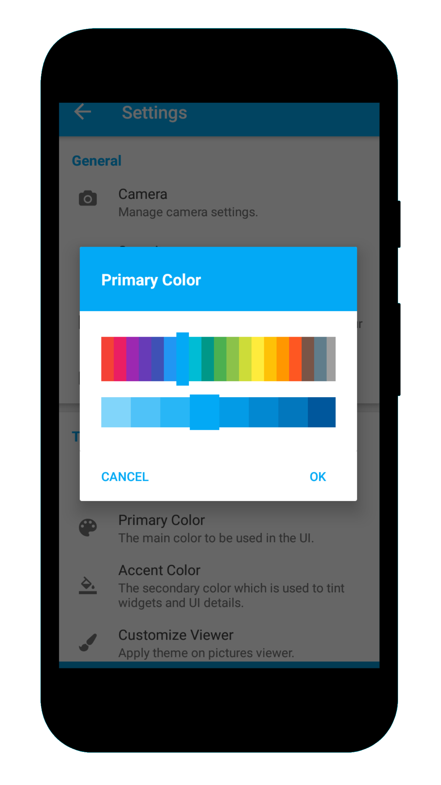

# Phimp.me Android

Phimp.me is a Photo App for Android that aims to replace proprietary photo applications. It offers features such as taking photos, adding filters, editing images and uploading them to social networks.

---

## Screenshots

  <table>
    <tr>
     <td></td>
     <td></td>
     <td></td>
     <td></td>
     <tr> 
      <td></td>
      <td></td>
      <td></td>
      <td></td>
    </tr>
  </table>
  
---

## Features
Do you also have many different apps in your Android Phone for image click, editing and sharing purpose? Now clean your phone memory. Phimpme is here, with all the features packaged into one.

* Click beautiful image from Phimpme app. Use various advance scene modes, and variety of While balance modes.
* You can use your voice actions to invoke Camera, Just say "Ok Google click a picture". You can also select front and rear camera based on voice.
* Browse the local gallery inside the app with folder and all photos mode. Copy, move to images, add description the images.
* Edit images with various advance filters, optimized performace using OpenCV library.
* Enhance contrast, hue, satur, temp, tint and sharpness of the image.
* Crop and rotate feature from Transform section.
* Apply different stickers of facial, express, objects, comments, wishes, emojis, hashtag
* You can also write anything on images in your handwriting.
* To fast the process, user can use the undo and redo features present in the editor.
* Finally, after all set, you can share the image to world using many connected social accounts.
* Facebook, Twitter, NextCloud, OwnCloud, Imgur, Dropbox, Box, Flickr, Pinterest, Instagram, Whatsapp and tumblr are working fine.

---

## How to Contribute
This is an Open Source project and we would be happy to see contributors who report bugs and file feature requests submitting pull requests as well.This project adheres to the Contributor Covenant [code of conduct](https://github.com/fossasia/phimpme-android/blob/development/CONTRIBUTING.md). By participating, you are expected to uphold this code style. Please report issues here https://github.com/fossasia/phimpme-android/issues

---

### Branch Policy
We have the following branches
 * **development**
	 All development goes on in this branch. If you're making a contribution,
	 you are supposed to make a pull request to _development_.
	 Make sure it pass a build check on Travis

	 It is advisable to clone only the development branch using following command:

	`git clone -b <branch> <remote_repo>`

	Example:

	`git clone -b my-branch git@github.com:user/myproject.git`

	Alternative (no public key setup needed):

	`git clone -b my-branch https://git@github.com/username/myproject.git`

	With Git 1.7.10 and later, add --single-branch to prevent fetching of all branches. Example, with development branch:

	`git clone -b development --single-branch https://github.com/username/phimpme-android.git`

 * **master**
   This contains the stable code. After significant features/bugfixes are accumulated on development, we move it to master.

 * **apk**
   This branch contains automatically generated apk file for testing.

 * **gh-pages**
   Hosting the landing page [phimp.me](http://phimp.me)  

---

## Development Setup

Before you begin, you should already have the Android Studio SDK downloaded and set up correctly. You can find a guide on how to do this here: [Setting up Android Studio](http://developer.android.com/sdk/installing/index.html?pkg=studio)

### Setting up the Android Project

1. Download the *phimpme-android* project source. You can do this either by forking and cloning the repository (recommended if you plan on pushing changes) or by downloading it as a ZIP file and extracting it.

2. Install the NDK in Android Studio.

3. Open Android Studio, you will see a **Welcome to Android** window. Under Quick Start, select *Import Project (Eclipse ADT, Gradle, etc.)*

4. Navigate to the directory where you saved the phimpme-android project, select the root folder of the project (the folder named "phimpme-android"), and hit OK. Android Studio should now begin building the project with Gradle.

5. Once this process is complete and Android Studio opens, check the Console for any build errors.

    - *Note:* If you recieve a Gradle sync error titled, "failed to find ...", you should click on the link below the error message (if avaliable) that says *Install missing platform(s) and sync project* and allow Android studio to fetch you what is missing.

6. Download this [OpenCV-android-sdk](https://github.com/opencv/opencv/releases/download/2.4.13.3/opencv-2.4.13.3-android-sdk.zip) zip file and extract it.

     - Copy all the files from *"OpenCV-android-sdk/sdk/native/3rdparty"* to *"phimpme-android/app/src/main/3rdparty"* (create directory if it doesn't exist)
     - Copy all the files from *"OpenCV-android-sdk/sdk/native/libs"* to *"phimpme-android/app/src/main/jniLibs"* (create directory if it doesn't exist)
     - Now build your project. If your build fails then try deleting these build directories *"phimpme-android/app/.externalNativeBuild"* and *"phimpme-android/app/build"*, if they exist and run the build again.

7. Once all build errors have been resolved, you should be all set to build the app and test it.

8. To Build the app, go to *Build>Make Project* (or alternatively press the Make Project icon in the toolbar).

9. If the app was built succesfully, you can test it by running it on either a real device or an emulated one by going to *Run>Run 'app'* or presing the Run icon in the toolbar.

10. **To enable the sharing features to different account, add API_KEY/ APP_ID associated with accounts**. Add the Keys in `constant.java` and `strings.xml`. Following are the links of developer pages of account. Go there to create apps and get keys.
    * Facebook: https://developers.facebook.com
    * Twitter: https://dev.twitter.com
    * Flickr: https://www.flickr.com/services/developer
    * Pinterest: https://developers.pinterest.com
    * Tumblr: https://www.tumblr.com/developers
    * Imgur: https://api.imgur.com
    * Box: https://developer.box.com
    * Dropbox: https://www.dropbox.com/developers
    
--- 

## License

This project is currently licensed under the GNU General Public License v3. A copy of [LICENSE](LICENSE.md) is to be present along with the source code. To obtain the software under a different license, please contact FOSSASIA.

---

## Maintainers
The project is maintained by
- Hon Nguyen ([@vanhonit](https://github.com/vanhonit))
- Mario Behling ([@mariobehling](http://github.com/mariobehling))

---

## Developers
<table>
<tr>
<td>
     
     
     Anant Prasad

</td>

<td>
     
     
     Mohit Manuja

</td>

<td>
     
     
     Pawan Pal

</td>

<td>
     
     
     Subhankar Shah

</td>

<td>
     
     
     Vinay Sajjanapu

</td>
</tr> 
  </table>
